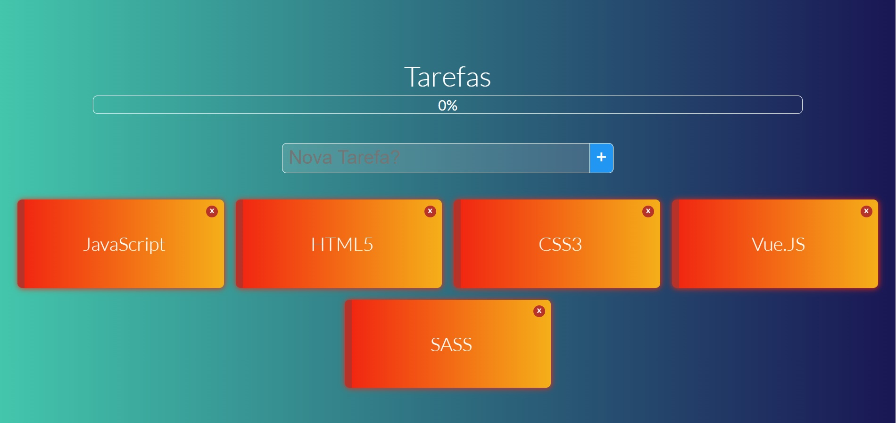

# Projeto Lista de Tarefas



## Conteúdo

- [Deploy](#Deploy)
- [Resumo](#Resumo)
- [Descrição](#Descrição)
- [O que aprendeu](#O-que-aprendeu)
- [Construido com](#Construido-com)
- [Autor](#Autor)
- [Como utilizar](#Como-utilizar)

## Deploy

- deploy: [Aplicativo Lista de Tarefas](https://jose-carlos-todolist-vue2x.netlify.app/)

## Resumo

Aplicação de listas de tarefas do dia a dia podendo ser apagada, selecionada como feito ou pendente.

## Descrição

Aplicação desenvolvida em Vue.JS, HTML5, CSS3, JavaScript, SASS utilizando os conceitos avançados de comunicação entre componentes.
Utilização de eventos, arrays, localStorage, propriedades: watch, computed, created. Manipula estados entre objetos com pendente e feito no array onde as tarefas são adicionadas.

## O que aprendeu

Utilizar componentes avançados, emitir eventos entre os componentes, manipular array, manipular eventos, utilizar o SASS.

## Construido com

Framework Vue.JS
HTML5
CSS3
JavaScript
SASS

## Autor

- Copyright (c): [José Carlos Rodrigues Filho](https://github.com/JoseCarlos-Filho/Lista-Tarefa-VueJS2x)

# Como-utilizar
# todolist

## Project setup
```
npm install
```

### Compiles and hot-reloads for development
```
npm run serve
```

### Compiles and minifies for production
```
npm run build
```

### Lints and fixes files
```
npm run lint
```

### Customize configuration
See [Configuration Reference](https://cli.vuejs.org/config/).
